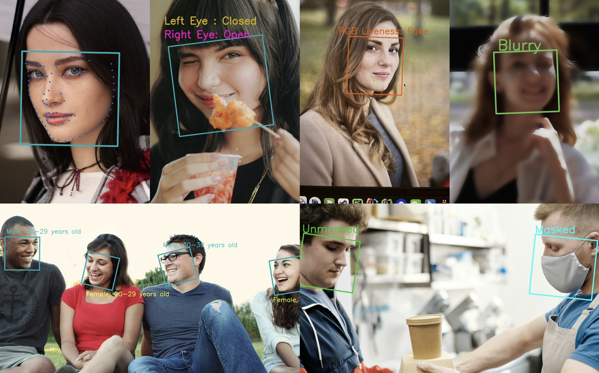

# InspireFace
[](https://github.com/HyperInspire/InspireFace/releases/latest)
[](https://pypi.org/project/inspireface/)
[](https://github.com/HyperInspire/InspireFace/actions/workflows/release-sdks.yaml)
[](https://github.com/HyperInspire/InspireFace/actions/workflows/test_ubuntu_x86_Pikachu.yaml)

InspireFace is a cross-platform face recognition SDK developed in C/C++, supporting multiple operating systems and various backend types for inference, such as CPU, GPU, and NPU.

If you require further information on tracking development branches, CI/CD processes, or downloading pre-compiled libraries, please visit our [development repository](https://github.com/HyperInspire/InspireFace).

Please contact [contact@insightface.ai](mailto:contact@insightface.ai?subject=InspireFace) for commercial support, including obtaining and integrating higher accuracy models, as well as custom development.



## Change Logs

**`2025-02-20`** Upgrade the face landmark model.

**`2025-01-21`** Update all models to t3 and add tool to convert cosine similarity to percentage.

**`2025-01-08`** Support inference on Rockchip devices **RK3566/RK3568** NPU.

**`2024-12-25`** Add support for optional **RKRGA** image acceleration processing on Rockchip devices.

**`2024-12-22`** Started adapting for multiple Rockchip devices with NPU support, beginning with **RV1103/RV1106** support.

**`2024-12-10`** Added support for quick installation via Python package manager.

**`2024-11-19`** Project has been made lighter by removing mandatory dependency on OpenCV.

**`2024-10-09`** Added system resource monitoring and session statistics.

**`2024-09-30`** Fixed some bugs in the feature hub.

**`2024-08-18`** Updating [Benchmark](doc/Benchmark-Remark(Updating).md): Using CoreML with Apple's Neural Engine (ANE) on the iPhone 13, the combined processes of **Face Detection** + **Alignment** + **Feature Extraction** take less than **2ms**.

**`2024-07-17`** Add global resource statistics monitoring to prevent memory leaks.

**`2024-07-07`** Add some face action detection to the face interaction module.

**`2024-07-05`** Fixed some bugs in the python ctypes interface.

**`2024-07-03`** Add the blink detection algorithm of face interaction module.

**`2024-07-02`** Fixed several bugs in the face detector with multi-level input.

**`2024-06-27`** Verified iOS usability and fixed some bugs.

**`2024-06-18`** Added face detection feature with tracking-by-detection mode.

**`2024-06-01`** Adapted for accelerated inference on CUDA-enabled devices.

## Quick Start

For Python users on Linux and MacOS, InspireFace can be quickly installed via pip:

```bash
pip install inspireface
```

_⚠️Windows support is **not available yet**, but will be coming soon!_

After installation, you can use inspireface like this:

```Python
import cv2
import inspireface as isf

# Create a session with optional features
opt = isf.HF_ENABLE_NONE
session = isf.InspireFaceSession(opt, isf.HF_DETECT_MODE_ALWAYS_DETECT)

# Load the image using OpenCV.
image = cv2.imread(image_path)

# Perform face detection on the image.
faces = session.face_detection(image)

for face in faces:
    x1, y1, x2, y2 = face.location
    rect = ((x1, y1), (x2, y2), face.roll)
     # Calculate center, size, and angle
    center = ((x1 + x2) / 2, (y1 + y2) / 2)
    size = (x2 - x1, y2 - y1)
    angle = face.roll

    # Apply rotation to the bounding box corners
    rect = ((center[0], center[1]), (size[0], size[1]), angle)
    box = cv2.boxPoints(rect)
    box = box.astype(int)

    # Draw the rotated bounding box
    cv2.drawContours(image, [box], 0, (100, 180, 29), 2)

cv2.imshow("face detection", image)
cv2.waitKey(0)
cv2.destroyAllWindows()
```

⚠️The project is currently in a rapid iteration phase, **before each update**, please pull the latest model from the remote side!

```python
import inspireface

for model in ["Pikachu", "Megatron"]:
    inspireface.pull_latest_model(model)
```

More examples can be found in the [python](python/) directory.

## Preparation
### Clone 3rdparty

Clone the `3rdparty` repository from the remote repository into the root directory of the project. Note that this repository contains some submodules. When cloning, you should use the `--recurse-submodules` parameter, or after entering the directory, use `git submodule update --init --recursive` to fetch and synchronize the latest submodules:

```Bash
# Must enter this directory
cd InspireFace
# Clone the repository and pull submodules
git clone --recurse-submodules https://github.com/tunmx/inspireface-3rdparty.git 3rdparty
```

If you need to update the `3rdparty` repository to ensure it is current, or if you didn't use the `--recursive` parameter during the initial pull, you can run `git submodule update --init --recursive`:

```bash
# Must enter this directory
cd InspireFace
# If you're not using recursive pull
git clone https://github.com/tunmx/inspireface-3rdparty.git 3rdparty

cd 3rdparty
git pull
# Update submodules
git submodule update --init --recursive
```

### Downloading Model Package Files

You can download the model package files containing models and configurations needed for compilation from [Release Page](https://github.com/HyperInspire/InspireFace/releases/tag/v1.x) and extract them to any location. 

You can use the **command/download_models_general.sh** command to download resource files, which will be downloaded to the **test_res/pack** directory. This way, when running the Test program, it can access and read the resource files from this path by default.

⚠️The project is currently in a rapid iteration phase, **before each update**, please pull the latest model from the remote side!

```bash
# Download lightweight resource files for mobile device
bash command/download_models_general.sh Pikachu
# Download resource files for mobile device or PC/server
bash command/download_models_general.sh Megatron
# Download resource files for RV1109
bash command/download_models_general.sh Gundam_RV1109
# Download resource files for RV1106
bash command/download_models_general.sh Gundam_RV1106
# Download resource files for RK356X
bash command/download_models_general.sh Gundam_RV356X

# Download all model files
bash command/download_models_general.sh
```

### Installing OpenCV(Optional)
For **InspireFace v1.1.8** and above, **OpenCV is optional and not required by default**. If you need OpenCV support, you can enable it using the cmake option ` INSPIRECV_BACKEND_OPENCV`.

### Installing MNN
The '**3rdparty**' directory already includes the MNN library and specifies a particular version as the stable version. If you need to enable or disable additional configuration options during compilation, you can refer to the CMake Options provided by MNN. If you need to use your own precompiled version, feel free to replace it.

### Requirements

- CMake (version 3.10 or higher)
- OpenCV (version 3.5 or higher) [**Optional**: If the version **>= 1.1.8**, opencv is not used by default]
    - Use the specific OpenCV-SDK supported by each target platform such as Android, iOS, and Linux.
- NDK (version 16 or higher, only required for Android) [**Optional**]
- MNN (version 1.4.0 or higher)
- C++ Compiler
    - Either GCC or Clang can be used (macOS does not require additional installation as Xcode is included)
        - Recommended GCC version is 4.9 or higher
            - Note that in some distributions, GCC (GNU C Compiler) and G++ (GNU C++ Compiler) are installed separately.
            - For instance, on Ubuntu, you need to install both gcc and g++
        - Recommended Clang version is 3.9 or higher
    - arm-linux-gnueabihf (for RV1109/RV1126) [**Optional**]
        - Prepare the cross-compilation toolchain in advance, such as gcc-arm-8.3-2019.03-x86_64-arm-linux-gnueabihf
- CUDA (version 10.1 or higher) [**Optional**]
    - GPU-based inference requires installing NVIDIA's CUDA dependencies on the device.
- Eigen3
  
- RKNN [**Optional**]
    - Adjust and select versions currently supported for specific requirements.

## Compilation
CMake option are used to control the various details of the compilation phase. Please select according to your actual requirements. [CMake Option](doc/CMake-Option.md).

### Local Compilation
Make sure OpenCV is installed, you can begin the compilation process.  If you are using macOS or Linux, you can quickly compile using the shell scripts provided in the `command` folder at the project root:
```bash
cd InspireFace/
# Execute the local compilation script
bash command/build.sh
```
After compilation, you can find the local file in the build directory, which contains the compilation results. The install directory structure is as follows:
```bash
inspireface-linux
   ├── include
   │   ├── herror.h
   │   └── inspireface.h
   └── lib
       └── libInspireFace.so
```

- **libInspireFace.so**：Compiled dynamic linking library.
- **inspireface.h**：Header file definition.
- **herror.h**：Reference error number definition.
### Cross Compilation
Cross compilation requires you to prepare the target platform's cross-compilation toolchain on the host machine in advance. Here, compiling for Rockchip's embedded devices RV1106 is used as an example:
```bash
# Set the path for the cross-compilation toolchain
export ARM_CROSS_COMPILE_TOOLCHAIN=YOUR_DIR/arm-rockchip830-linux-uclibcgnueabihf
# Execute the cross-compilation script for RV1106
bash command/build_cross_rv1106_armhf_uclibc.sh
```
After the compilation is complete, you can find the compiled results in the `build/inspireface-linux-armv7-rv1106-armhf-uclibc` directory.

### iOS Compilation

To compile for iOS, ensure you are using a Mac device. The script will automatically download third-party dependencies into the `.macos_cache` directory.

```
bash command/build_ios.sh
```

After the compilation is complete, `inspireface.framework` will be placed in the `build/inspireface-ios` directory.

### Android Compilation

You can compile for Android using the following command, but first you need to set your Android NDK path:

```
export ANDROID_NDK=YOUR_ANDROID_NDK_PATH
bash command/build_android.sh
```

After the compilation is complete, arm64-v8a and armeabi-v7a libraries will be placed in the `build/inspireface-android` directory.

### Supported Platforms and Architectures
We have completed the adaptation and testing of the software across various operating systems and CPU architectures. This includes compatibility verification for platforms such as Linux, macOS, iOS, and Android, as well as testing for specific hardware support to ensure stable operation in diverse environments.

| **No.** | **Platform** | **CPU Architecture** | **Special Device Support** | **Adapted** | **Passed Tests** |
| ------- | -------------------- | --------------------- | -------------------------- | ----------- | ---------------- |
| 1       | **Linux-CPU**        | ARMv7                 | -                          | [](https://github.com/HyperInspire/InspireFace/actions/workflows/release-sdks.yaml) |  |
| 2       |                      | ARMv8                 | -                          | [](https://github.com/HyperInspire/InspireFace/actions/workflows/release-sdks.yaml) |  |
| 3       |                      | x86/x86_64            | -                          | [](https://github.com/HyperInspire/InspireFace/actions/workflows/release-sdks.yaml) | [](https://github.com/HyperInspire/InspireFace/actions/workflows/test_ubuntu_x86_Pikachu.yaml) |
| 4       | **Linux-Rockchip** | ARMv7                 | RV1109/RV1126              | [](https://github.com/HyperInspire/InspireFace/actions/workflows/release-sdks.yaml) |  |
| 5 | | ARMv7 | RV1103/RV1106 | [](https://github.com/HyperInspire/InspireFace/actions/workflows/release-sdks.yaml) ||
| 6 | | ARMv8 | RK3566/RK3568 | [](https://github.com/HyperInspire/InspireFace/actions/workflows/release-sdks.yaml) |  |
| 7 | | ARMv8 | RK3588 |  |  |
| 8      | **Linux-CUDA(MNN)** | x86/x86_64            | NVIDIA-GPU          |  |  |
| 9      | **MacOS**           | Intel       | CPU/Metal/**ANE** | [](https://github.com/HyperInspire/InspireFace/actions/workflows/release-sdks.yaml) |  |
| 10   |                      | Apple Silicon         | -                          | [](https://github.com/HyperInspire/InspireFace/actions/workflows/release-sdks.yaml) |  |
| 11     | **iOS**              | ARM                   | CPU/Metal/**ANE**         | [](https://github.com/HyperInspire/InspireFace/actions/workflows/release-sdks.yaml) |  |
| 12     | **Android**          | ARMv7                 | -                          | [](https://github.com/HyperInspire/InspireFace/actions/workflows/release-sdks.yaml) |  |
| 13     |                      | ARMv8                 | -                          | [](https://github.com/HyperInspire/InspireFace/actions/workflows/release-sdks.yaml) |  |
| 14 | **Android-Rockchip** | ARMv8 | RK3566/RK3568 |  |  |
| 15 |  | ARMv8 | RK3588 |  |  |
| 16 | **HarmonyOS** | ARMv8 | - |  |  |
| 17 | **Jetson series** | ARMv8 | - |  |  |

- Complete compilation scripts and successful compilation.
- Pass unit tests on physical devices.
- Meet all performance benchmarks in tests.

### Multi-platform compilation using Docker

We offer a method for rapid multi-platform compilation using Docker, provided that Docker is installed beforehand, and the appropriate commands are executed:
```Bash
# Build x86 Ubuntu18.04
docker-compose up build-ubuntu18

# Build armv7 cross-compile
docker-compose up build-cross-armv7-armhf

# Build armv7 with support RV1109RV1126 device NPU cross-complie
docker-compose up build-cross-rv1109rv1126-armhf

# Build armv7 with support RV1106 device NPU cross-complie
docker-compose up build-cross-rv1106-armhf-uclibc

# Build armv8 with support RK356x device NPU cross-complie
docker-compose up build-cross-rk356x-aarch64

# Build Android with support arm64-v8a and armeabi-v7a
docker-compose up build-cross-android

# Build all
docker-compose up
```

## Example
### C/C++ Sample
To integrate InspireFace into a C/C++ project, you simply need to link the InspireFace library and include the appropriate header files. Below is a basic example demonstrating face detection:

```c
HResult ret;
// The resource file must be loaded before it can be used
ret = HFLaunchInspireFace(packPath);
if (ret != HSUCCEED) {
    std::cout << "Load Resource error: " << ret << std::endl;
    return ret;
}

// Enable the functions in the pipeline: mask detection, live detection, and face quality
// detection
HOption option = HF_ENABLE_QUALITY | HF_ENABLE_MASK_DETECT | HF_ENABLE_LIVENESS;
// Non-video or frame sequence mode uses IMAGE-MODE, which is always face detection without
// tracking
HFDetectMode detMode = HF_DETECT_MODE_ALWAYS_DETECT;
// Maximum number of faces detected
HInt32 maxDetectNum = 20;
// Face detection image input level
HInt32 detectPixelLevel = 160;
// Handle of the current face SDK algorithm context
HFSession session = {0};
ret = HFCreateInspireFaceSessionOptional(option, detMode, maxDetectNum, detectPixelLevel, -1, &session);
if (ret != HSUCCEED) {
    std::cout << "Create FaceContext error: " << ret << std::endl;
    return ret;
}

HFSessionSetTrackPreviewSize(session, detectPixelLevel);
HFSessionSetFilterMinimumFacePixelSize(session, 4);

// Load a image
HFImageBitmap image;
ret = HFCreateImageBitmapFromFilePath(sourcePath, 3, &image);
if (ret != HSUCCEED) {
    std::cout << "The source entered is not a picture or read error." << std::endl;
    return ret;
}
// Prepare an image parameter structure for configuration
HFImageStream imageHandle = {0};
ret = HFCreateImageStreamFromImageBitmap(image, rotation_enum, &imageHandle);
if (ret != HSUCCEED) {
    std::cout << "Create ImageStream error: " << ret << std::endl;
    return ret;
}

// Execute HF_FaceContextRunFaceTrack captures face information in an image
HFMultipleFaceData multipleFaceData = {0};
ret = HFExecuteFaceTrack(session, imageHandle, &multipleFaceData);
if (ret != HSUCCEED) {
    std::cout << "Execute HFExecuteFaceTrack error: " << ret << std::endl;
    return ret;
}
// Print the number of faces detected
auto faceNum = multipleFaceData.detectedNum;
std::cout << "Num of face: " << faceNum << std::endl;

// The memory must be freed at the end of the program
ret = HFReleaseImageBitmap(image);
if (ret != HSUCCEED) {
    printf("Release image bitmap error: %lu\n", ret);
    return ret;
}

ret = HFReleaseImageStream(imageHandle);
if (ret != HSUCCEED) {
    printf("Release image stream error: %lu\n", ret);
}
ret = HFReleaseInspireFaceSession(session);
if (ret != HSUCCEED) {
    printf("Release session error: %lu\n", ret);
    return ret;
}
```
For more examples, you can refer to the `cpp/sample` sub-project located in the root directory. You can compile these sample executables by enabling the `ISF_BUILD_WITH_SAMPLE` option during the compilation process.

**Note**: For each error code feedback, you can click on this [link](doc/Error-Feedback-Codes.md) to view detailed explanations.

### Python Native Sample

#### Use pip to install InspireFace

You can use pip to install the InspireFace Python package:

```bash
pip install inspireface
```

#### Python Native Sample

We provide a Python API that allows for more efficient use of the InspireFace library. After compiling the dynamic link library, you need to either symlink or copy it to the `python/inspireface/modules/core` directory within the root directory. You can then start testing by navigating to the **[python](python/)** directory. Your Python environment will need to have some dependencies installed:

- python >= 3.7
- opencv-python
- loguru
- tqdm
- numpy
- ctypes
```bash
# Use a symbolic link
ln -s YOUR_BUILD_DIR/install/InspireFace/lib/libInspireFace.so python/inspireface/modules/core/PLATFORM/ARCH/
# Navigate to the sub-project directory
cd python
```

Import inspireface for a quick facial detection example:
```python
import cv2
import inspireface as isf

# Step 1: Initialize the SDK globally (only needs to be called once per application)
ret = isf.reload()
assert ret, "Launch failure. Please ensure the resource path is correct."

# Optional features, loaded during session creation based on the modules specified.
opt = isf.HF_ENABLE_NONE
session = isf.InspireFaceSession(opt, isf.HF_DETECT_MODE_ALWAYS_DETECT)

# Load the image using OpenCV.
image = cv2.imread(image_path)
assert image is not None, "Please check that the image path is correct."

# Perform face detection on the image.
faces = session.face_detection(image)
print(f"face detection: {len(faces)} found")

# Copy the image for drawing the bounding boxes.
draw = image.copy()
for idx, face in enumerate(faces):
    print(f"{'==' * 20}")
    print(f"idx: {idx}")
    # Print Euler angles of the face.
    print(f"roll: {face.roll}, yaw: {face.yaw}, pitch: {face.pitch}")
    # Draw bounding box around the detected face.
    x1, y1, x2, y2 = face.location
    cv2.rectangle(draw, (x1, y1), (x2, y2), (0, 0, 255), 2)
```
In the project, more usage examples are provided:

- sample_face_detection.py: Facial detection example
- sample_face_recognition.py: Facial recognition example
- sample_face_track_from_video.py: Facial tracking from video stream example

### Java and Android platform API

We have prepared an Android sample project. You can download library from the [Release Page](https://github.com/HyperInspire/InspireFace/releases) or compile the Android library yourself and place it in the `inspireface/libs ` directory of the Android sample project. You can compile and run this project using Android Studio.

```bash
InspireFaceExample/inspireface/libs
├── arm64-v8a
│   └── libInspireFace.so
└── armeabi-v7a
    └── libInspireFace.so
```

You need to get the resource file from the release  [Release Page](https://github.com/HyperInspire/InspireFace/releases) and place it in the asset/inspireface in your android project:

```
asset/
└── inspireface/
    └── Pikachu
```

We provide a Java API for Android devices, which is implemented using Java Native Interface(JNI). 

```java
// Launch InspireFace, only need to call once
boolean launchStatus = InspireFace.GlobalLaunch(folder + "/Pikachu");
if (!launchStatus) {
    Log.e(TAG, "Failed to launch InspireFace");
}

// Create a ImageStream
ImageStream stream = InspireFace.CreateImageStreamFromBitmap(img, InspireFace.CAMERA_ROTATION_0);

// Create a session
CustomParameter parameter = InspireFace.CreateCustomParameter()
                .enableRecognition(true)
                .enableFaceQuality(true)
                .enableFaceAttribute(true)
                .enableInteractionLiveness(true)
                .enableLiveness(true)
                .enableMaskDetect(true);
Session session = InspireFace.CreateSession(parameter, InspireFace.DETECT_MODE_ALWAYS_DETECT, 10, -1, -1);

// Execute face detection
MultipleFaceData multipleFaceData = InspireFace.ExecuteFaceTrack(session, stream);
if (multipleFaceData.detectedNum > 0) {
    // Get face feature
    FaceFeature feature = InspireFace.ExtractFaceFeature(session, stream, multipleFaceData.tokens[0]);
    // ....
}

// .... 

// Release resource
InspireFace.ReleaseSession(session);
InspireFace.ReleaseImageStream(stream);

// Global release
InspireFace.GlobalRelease();
```

## Test

In the project, there is a subproject called `cpp/test`. To compile it, you need to enable the **ISF_BUILD_WITH_TEST** switch, which will allow you to compile executable programs for testing.

```bash
cmake -DISF_BUILD_WITH_TEST=ON ..
```
To run the test modules in the project, first check if the resource files exist in the test_res/pack directory. If they don't exist, you can either execute **command/download_models_general.sh** to download the required files, or download the files from the [Release Page](https://github.com/HyperInspire/InspireFace/releases/tag/v1.x) and manually place them in this directory.

```bash

test_res
├── data
├── images
├── pack	<-- The model package files are here
├── save
├── valid_lfw_funneled.txt
├── video
└── video_frames

```
After compilation, you can find the executable program "**Test**" in `YOUR_BUILD_FOLDER/test`. The program accepts two optional parameters:

- **test_dir**：Path to the test resource files
- **pack**：Name of the model to be tested
```bash
./Test --test_dir PATH/test_res --pack Pikachu
```
During the process of building the test program using CMake, it will involve selecting CMake parameters. For specific details, you can refer to the parameter configuration table.

**Note**: If you want to view the benchmark test report, you can click on the [link](doc/Benchmark-Remark(Updating).md).

### Quick Test

If you need to perform a quick test, you can use the script we provide. This script will automatically download the test file `test_res` and build the test program to run the test. 

*Note: If you need to enable more comprehensive tests, you can adjust the options in the script as needed.*

```bash
# If you are using Ubuntu, you can execute this.
bash ci/quick_test_linux_x86_usual.sh

# If you are using another system (including Ubuntu), you can execute this.
bash ci/quick_test_local.sh
```

Every time code is committed, tests are run on GitHub Actions.

## Features
The following Features and technologies are currently supported.

| Index | Feature | Adaptation | Note |
| -- | --- | --- | --- |
| 1 | Face Detection |  | SCRFD |
| 2 | Facial Landmark Detection |  | HyperLandmarkv2 |
| 3 | Face Recognition |  | ArcFace |
| 4 | Face Alignment |  |  |
| 5 | Face Tracking |  | Fast tracking and By-Detection |
| 6 | Mask Detection |  |  |
| 7 | Silent Liveness Detection |  | MiniVision |
| 8 | Face Quality Detection |  |  |
| 9 | Face Pose Estimation |  |  |
| 10 | Face Attribute Prediction |  | Age, Race, Gender |
| 11 | Cooperative Liveness Detection |  | Expressions and head |
| 12 | Face Embedding Management |  | Memory and Persistence |


## Resource Package List

For different scenarios, we currently provide several Packs, each containing multiple models and configurations.

| Name | Supported Devices | Note | Last Update | Link |
| --- | --- | --- | --- | --- |
| Pikachu | CPU | Lightweight edge-side models | Feb 20, 2025 | [Download](https://github.com/HyperInspire/InspireFace/releases/download/v1.x/Pikachu) |
| Megatron | CPU, GPU | Mobile and server models | Feb 20, 2025 | [Download](https://github.com/HyperInspire/InspireFace/releases/download/v1.x/Megatron) |
| Gundam-RV1109 | RKNPU | Supports RK1109 and RK1126 | Feb 20, 2025 | [Download](https://github.com/HyperInspire/InspireFace/releases/download/v1.x/Gundam_RV1109) |
| Gundam-RV1106 | RKNPU | Supports RV1103 and RV1106 | Feb 20, 2025 | [Download](https://github.com/HyperInspire/InspireFace/releases/download/v1.x/Gundam_RV1106) |
| Gundam-RK356X | RKNPU | Supports RK3566 and RK3568 | Feb 20, 2025 | [Download](https://github.com/HyperInspire/InspireFace/releases/download/v1.x/Gundam_RK356X) |
| Goku | APPLE | Supports CPU, Metal and ANE | - | - |

## Plan

- [ ] Added TensorRT back-end support

## Acknowledgement

InspireFace is built on the following libraries:

- [MNN](https://github.com/alibaba/MNN)
- [RKNN](https://github.com/rockchip-linux/rknn-toolkit)
- [RKNN2](https://github.com/airockchip/rknn-toolkit2.git)
- [librga](https://github.com/airockchip/librga.git)
- [Eigen](https://eigen.tuxfamily.org/index.php?title=Main_Page)
- [sqlite](https://www.sqlite.org/index.html)
- [sqlite-vec](https://github.com/asg017/sqlite-vec)
- [Catch2](https://github.com/catchorg/Catch2)
- [yaml-cpp](https://github.com/jbeder/yaml-cpp)